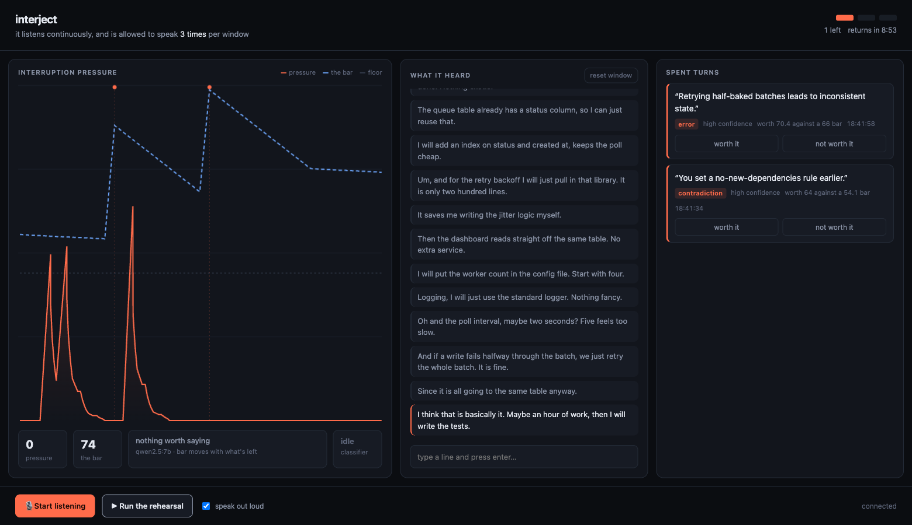

# interject

A listener that is allowed to speak three times an hour, and has to decide —
while you are still talking — whether what it has to say is worth one of them.

Everything runs locally. A 7B model on Ollama, the browser's own speech
recognition, and a Go server holding the budget. No API key, no cloud, no
account.



```bash
ollama serve && ollama pull qwen2.5:7b
go run .        # then open http://127.0.0.1:8722
```

**Run the rehearsal** replays a canned monologue, so you can watch the whole
arc without a microphone or saying a word.

## The idea

Assistants are free to speak, so they speak constantly, and the only way to
find the one useful sentence is to read all the useless ones. Rationing changes
that. If a listener gets three interruptions an hour, every one it spends is a
claim that this was worth your train of thought — and unlike a confidence
score, that claim costs it something. You cannot fake calibration you have to
pay for.

The hard part is timing. Deciding **whether** to speak has to happen in about
200ms, at the moment a gap opens. Deciding **what** to say takes a local model
one to two seconds. Those numbers do not fit.

They fit if you stop treating it as a question asked at the gap. The classifier
runs continuously *while you talk*, so an opinion is always already formed; the
pause only reads one that is sitting there. Deciding continuously is what makes
deciding instantly possible.

## How it decides

The model is a **sensor**, not the agent. It answers one question — what kind
of thing was just said — and never decides whether to speak:

| kind | what it means |
|---|---|
| `error` | a concrete mistake that costs time, money, or a security incident |
| `contradiction` | conflicts with a constraint they set earlier in this session |
| `blindspot` | an important case they clearly have not considered |
| `circling` | already settled, being re-litigated |
| `none` | ordinary thinking — almost everything |

All the scarcity lives in [`internal/budget`](internal/budget/budget.go), in
deterministic, table-tested code. A rationed speaker whose restraint came from
a model's mood would not be rationed at all.

- **Pressure** is the kind's weight scaled by confidence, run through an
  envelope that rises fast and falls slow: something worth saying registers
  immediately, and a missed opening stays warm rather than vanishing between
  two words.
- **The bar** is what pressure has to clear. It rises when the speaker outruns
  its own pace and falls when it has been hoarding — spend two of three in the
  first minute and only a genuine error gets through for the rest of the window.
- **Having just spoken** is priced into the bar as a surcharge that decays,
  rather than a fixed cooldown. A cooldown cannot tell a trivial remark from a
  serious mistake spotted eight seconds later and would swallow both.
- **A floor** nothing may cross however rich the budget. Having interruptions
  left is not a reason to use one.
- **Your verdict** on each interruption moves the bar. Told it wasted a turn,
  everything afterward gets more expensive.

Two guards exist because a small model reliably gets these wrong: a
`contradiction` claimed in the first few utterances has nothing to contradict
and is discounted, and an opinion the model cannot phrase in a sentence is not
an opinion.

## Run it

```bash
ollama serve && ollama pull qwen2.5:7b
```

```bash
go run . 
```

Open http://127.0.0.1:8722. **Run the rehearsal** replays a canned monologue so
you can watch the whole arc without saying anything; **Start listening** uses
the mic (Chrome or Safari — Firefox has no speech recognition). You can also
just type lines.

Worth watching in the rehearsal: it stays silent through eleven of fourteen
utterances, spends one on a real contradiction, and then — with the bar raised
behind it — only a more expensive error gets through.

Tuning, all live:

```bash
go run . -budget 3 -window 10m -cooldown 25s -base 56 -floor 44
```

`prompts/classify.md` is re-read on every call, so you can edit the classifier
against a running session.

## Shape

```
main.go              flags, routes, embedded UI
internal/budget      policy — the ration. pure, table-tested
internal/listen      mechanism — one classification from any OpenAI-shaped endpoint
internal/session     composition — transcript in, decisions out
internal/stream      mechanism — SSE fan-out
web/                 vanilla HTML/CSS/JS, no build step
```

Because `listen` speaks the OpenAI wire format, pointing it at a hosted model
is a flag, not a code change:

```bash
OPENAI_API_KEY=sk-... go run . -base-url https://api.openai.com/v1 -model gpt-4o-mini
```

## Known rough edges

- `qwen2.5:7b` is a coarse sensor and a larger model grades more finely. It
  does catch the obvious ones — a JWT in localStorage classifies `error` at
  high confidence — but treat the kind and confidence as a rough signal. The
  policy is the interesting part; the sensor is swappable by flag.
- Browser speech recognition sends audio to the vendor. Only the mic path does;
  rehearsal and typing are fully local.

## What this is not

A prototype for one idea, built in a session to see whether the idea survives
contact with a running system. It has no persistence, one session per process,
and no tests above the policy layer.
